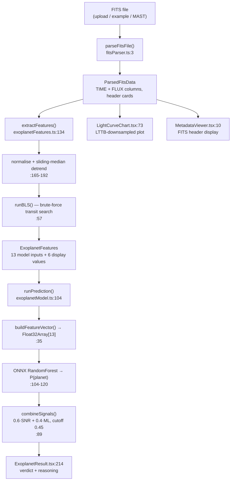

# ExoScope — Architecture

How the code actually works, mapped to real files and line numbers.

This document describes **what is in the repository**, verified by running it.
Where a behaviour is wrong or a claim is unproven, it says so. If this file ever
disagrees with the code, the code wins — fix this file.

---

## What it does

A telescope records how bright a star is, over and over, for months. That
recording is a **light curve**. If a planet orbits the star and its orbit is
edge-on from our viewpoint, the planet passes in front of the star and the
brightness dips by a fraction of a percent for a few hours, then repeats every
orbit. That repeating dip is a **transit**.

ExoScope takes a Kepler light curve file, searches it for a repeating dip,
and estimates whether that dip looks like a planet. Everything runs in the
browser — the FITS file is never uploaded anywhere.

---

## Pipeline



Orchestration is `handleDataLoaded` in [`App.tsx:410`](App.tsx). All three entry
points — upload, example buttons, archive search — call it with the same
`ParsedFitsData`.

---

## Step 1 — Read the FITS file

**`utils/fitsParser.ts`** (311 lines)

FITS is a 1980s astronomy container format: fixed 2880-byte blocks, an ASCII
header of 80-character "cards", then a binary table.

| Function | Line | Does |
|---|---|---|
| `parseFitsFile` | 3 | Walks HDUs until it finds the `BINTABLE` extension |
| `parseHeaderUnit` | 94 | Reads 80-char cards, handles `''` quote escaping |
| `parseColumnDefinitions` | 202 | Reads `TFORM`/`TTYPE`, computes byte offsets |
| `readBinaryTable` | 269 | Big-endian reads of each column, `NaN` → `null` |

Numbers are big-endian (`getFloat64(pos, false)`). Kepler marks bad cadences as
`NaN`, which becomes `null` and is filtered downstream.

**Verified working.** Parsing a real `kplr002445129-2009166043257_llc.fits`
downloaded live from MAST reads all 20 columns in ~2 ms, and the stellar values
it pulls from the header (`TEFF=5927`, `RADIUS=1.06`) match the NASA catalog
entry for that star exactly.

Caveats: `TSCALn`/`TZEROn` column scaling is not applied (Kepler light curves
don't use it); columns with `TFORM` repeat > 1 are skipped but still counted for
byte alignment; there's no check that the file starts with `SIMPLE  =`, so a
non-FITS upload produces a confusing error rather than a clear one.

---

## Step 2 — Clean up the brightness data

**`utils/exoplanetFeatures.ts:134-202`** (`extractFeatures`)

1. Keep rows where TIME and FLUX are both present and flux > 0 (`:143-151`)
2. Sort by time (`:153-155`)
3. Divide by the median so out-of-transit sits at 1.0 (`:165-167`)
4. Downsample to at most 15,000 points (`MAX_PTS`, `:172`)
5. **Detrend** with a sliding median over a 0.75-day window (`:179-192`)
6. Clip points more than 4σ from 1.0 (`:194-202`)

Step 5 is the important one. Stars are intrinsically variable — spots and
rotation cause slow brightness swings much larger than a transit. Dividing by a
local median over a window *longer than a transit but shorter than stellar
rotation* flattens the slow variation while leaving the sharp dip intact.

Tradeoff: transits longer than about 9 hours start contaminating their own
median window, which suppresses the measured depth.

---

## Step 3 — Search for a repeating dip (BLS)

**`utils/exoplanetFeatures.ts:57-117`** (`runBLS`)

A transit is defined by three unknowns that must be guessed *together*:
**period** (how often), **duration** (how long), **phase** (when the first one
starts). BLS — Box Least Squares — brute-forces combinations of all three.

For each combination it splits every measurement into "in transit" or "out of
transit", compares the two averages, and scores the result:

```
depth = mean(out) − mean(in)
power = depth · √(N_in) / σ          // exoplanetFeatures.ts:104
```

The grid searched (`:67-72`):

| Dial | Count | Values |
|---|---|---|
| Period | 1,000 | log-spaced, 0.3 d → min(baseline × 0.49, 500 d) |
| Duration | 12 | fixed fractions of period, 0.004 → 0.078 |
| Phase | 20 | evenly spaced across one period |

That is 240,000 combinations, each scanning every data point.

### ⚠️ This grid is too coarse — it is the project's main open bug

**Phase.** `N_PHASES = 20` regardless of period. At P = 10.18 d that places a
trial every ~12 hours while hunting a 3.5-hour dip, so the search can step
straight over a real transit.

**Period.** 1,000 log-spaced periods don't land on the true one. For
KIC 3115833 the nearest grid period is 10.20109 d against a true 10.1816 d. Over
the 8.7 orbits in one quarter that 0.0195 d error accumulates to 0.17 d of
drift — **1.16× the transit duration** — so the transits smear out of the box.

Measured on the bundled `KIC 3115833` example:

| Search | SNR found |
|---|---|
| At the true period, fine phase sampling (400) | **10.15** |
| At the true period, shipped 20-phase grid | **1.47** |
| Shipped full search (finds P = 7.99 d) | **4.80** |

The signal is there. The search cannot see it.

**Consequence:** the bundled "Planet Candidate" example currently returns
**"No Exoplanet Detected" at 45%**. With a correct SNR of ~10.15 the same ML
output produces ~79% "detected". See *Known issues* below.

---

## Step 4 — Classify

**`utils/exoplanetModel.ts`** (153 lines)

`buildFeatureVector` (`:35`) packs 13 numbers, in this exact order:

```
0  period_days          4  stellar_logg          8  log_depth
1  transit_depth_ppm    5  stellar_radius_rsun   9  log_period
2  transit_duration_hr  6  depth_per_hr         10  log_duration
3  stellar_teff_k       7  duty_cycle           11  depth × logg
                                                12  period ÷ stellar_radius
```

Stellar values come from the FITS header (`TEFF`, `LOGG`, `RADIUS`), falling
back to solar values (5778 K, 4.44, 1.0) when absent — `:158-160` of
`exoplanetFeatures.ts`. The two bundled example files have these keys stripped,
so they run on solar defaults.

### What the model actually is

Verified by parsing `public/model/exoscope_model.onnx` directly:

| Property | Value |
|---|---|
| Graph | `Imputer → Scaler → TreeEnsembleClassifier` |
| Algorithm | **RandomForest** (`post_transform=NONE`, leaf weights are multiples of 1/150) |
| Trees | **150** |
| Inputs | 13 float32 |
| Outputs | `label`, `probabilities` (shape `[N,2]`) |
| Exported by | skl2onnx 1.20.0 |

Trained on **7,586 rows** of `ml/koi_cumulative.csv` — every entry dispositioned
`CONFIRMED` (2,747) or `FALSE POSITIVE` (4,839); `CANDIDATE` rows are excluded.
Confirmed by comparing the ONNX `Scaler` offsets against column means computed
from that CSV: `koi_period` 51.65589, `koi_duration` 5.71288, `duty_cycle`
0.04789 — matching to five decimal places.

> **`ml/train_model.py` does not reproduce this model.** It builds 10 features
> and a `GradientBoostingClassifier`; the shipped model has 13 features and is a
> 150-tree RandomForest. The script that produced `exoscope_model.onnx` is not in
> the repository. Retraining requires reconstructing it first.

> `ml/feature_config.json` and `public/model/feature_config.json` are **not read
> by the application**. Their `threshold: 0.25` has no effect; the live cutoff is
> 0.45 in `combineSignals`.

---

## Step 5 — Decide

**`utils/exoplanetModel.ts:89-101`** (`combineSignals`)

```
snrScore = 1 / (1 + e^(−(SNR − 8) / 2))     // squash SNR into 0–1
combined = 0.60 · snrScore + 0.40 · mlProb
verdict  = combined ≥ 0.45
```

Because the ML term spans at most 0.40 of the range, it cannot always affect
the outcome:

| BLS SNR | Effect of the ML score |
|---|---|
| < 3.2 | none — always "no planet" |
| 3.2 – 10.2 | decisive |
| > 10.2 | none — always "planet" |

The `PredictionResult` fields are **misnamed**: `rfConfidence` holds the BLS
`snrScore` and `gbConfidence` holds the ML probability (`:147-148`). The UI
labels them correctly ("BLS + Physics" / "ML Score"), but the field names are
left over from an earlier two-model design.

`overridden` / `overrideReason` are always `false`/`undefined` (`:149-150`), so
the "Physics Override" banner in `ExoplanetResult.tsx:245` is dead UI.

---

## Repository layout

```
App.tsx                       Root component, animated demo, orchestration (:410)
index.tsx                     React entry point
types.ts                      Shared interfaces
components/
  FileUpload.tsx              Drag-and-drop .fits upload
  ExampleFiles.tsx            Two Kepler files embedded as base64
  ArchiveSearch.tsx           NASA Exoplanet Archive search + MAST fetch
  LightCurveChart.tsx         Flux vs time, LTTB downsampled to 3,000 points
  MetadataViewer.tsx          FITS header display
  ExoplanetResult.tsx         Verdict card + generated scientific reasoning
utils/
  fitsParser.ts               FITS binary reader
  exoplanetFeatures.ts        Detrending, BLS, feature computation
  exoplanetModel.ts           ONNX inference + decision logic
api/mast.ts                   Vercel serverless proxy for MAST downloads
ml/
  train_model.py              ⚠️ stale — does not build the shipped model
  koi_cumulative.csv          NASA KOI catalog (9,564 rows)
  exoscope_model.onnx         Copy of the shipped model
public/model/                 Model served to the browser
```

`public/ort*` (the onnxruntime-web distribution, ~96 MB) is **gitignored**. The
runtime loads WASM from a CDN, so those files are never served. They existed for
a removed predictor that set `wasmPaths = "/"`.

---

## Known issues

Ordered by impact.

1. **BLS grid too coarse** (`exoplanetFeatures.ts:67-68`) — see Step 3. Causes
   the bundled positive example to return a false negative. Fixing the phase
   count alone is ~6.7× slower; the real fix is phase-binning the fold instead
   of rescanning every point per trial.

2. **~9 second UI freeze.** `extractFeatures` is synchronous on the main thread
   (`App.tsx:416`) with no worker and no yields. Measured 3.3 s for 1,626 rows,
   8.7 s for 4,075 rows.

3. **Archive search only works on Vercel.** `ArchiveSearch.tsx:160,177` requests
   `/api/mast`, implemented as a Vercel function in `api/mast.ts`. In `npm run
   dev` that path returns HTTP 500. `vite.config.ts:11-18` already defines a
   working `/mast-proxy` route that nothing calls.

4. **`.github/workflows/deploy.yml` targets GitHub Pages**, but upstream history
   shows the project moved to Vercel and reverted the Pages base path. With no
   `base` set, absolute asset paths break on a project-page URL, and `/api/mast`
   cannot exist on Pages at all. The workflow is likely stale.

5. **Train/serve skew.** The model learned from NASA's catalog values, measured
   across the full multi-year mission. At inference it receives BLS estimates
   from a single ~90-day quarter. `duty_cycle` — the highest-importance feature —
   can only take the 12 values in `DUR_FRACS`, having been continuous in
   training. The model also only ever saw objects that already passed NASA's
   detection pipeline, so "no signal at all" is outside its training
   distribution.

6. **Wrong equilibrium temperature displayed.** `ExoplanetResult.tsx:217` calls
   `getEquilibriumTemp(period)` (`exoplanetFeatures.ts:277`), which assumes a
   Sun-like host. `features.eq_temperature_k` already holds the correct value
   using the actual `TEFF` and `RADIUS`. The habitable-zone flag uses the wrong
   one.

7. **`index.html` links `/index.css`, which does not exist** — the build warns
   and the request 404s at runtime.

8. **Leftover scaffolding.** `vite.config.ts:21-24` inlines `GEMINI_API_KEY`
   into the bundle via `define`; the key is never used, but a `.env.local`
   present at build time would be baked into public JavaScript. The
   `importmap` in `index.html:25-35` points at `aistudiocdn.com` and is
   overridden by Vite.

---

## Things earlier documentation claimed that are not true

The old README and SETUP.md described designs that never shipped in this form:

| Claim | Reality |
|---|---|
| "Random Forest + Gradient Boosting ensemble" | One RandomForest. No gradient boosting anywhere. |
| "26 features" / "10 features" | 13 |
| "Lomb-Scargle periodogram" | BLS |
| "`rfScore()` / `gbScore()` in TypeScript" | ONNX inference; no such functions |
| "Three physics override rules" | `overridden` is hardcoded `false` |
| "500 trees, max_depth 12" | 150 trees |
| "99.5% / 97.12% accuracy" | Unverifiable; not reproducible from this repo |
| "~80.9% real-world accuracy on 170 files" | No such evaluation exists here |
| "up to 65,000 points" charted | `MAX_DISPLAY_POINTS = 3000` |

There is currently **no defensible accuracy number** for this project. Producing
one means running the corrected pipeline over a labelled sample of Kepler files
and measuring it.
